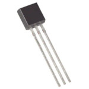
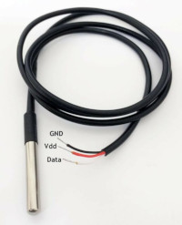

### Maxim Integrated: **DS18B20**

The DS18B20 digital thermometer provides 9-bit to 12-bit Celsius temperature measurements and has an alarm function with nonvolatile user-programmable upper
and lower trigger points. 
The DS18B20 communicates over a 1-Wire bus that by definition requires only one
data line (and ground) for communication with a central microprocessor. In addition, the DS18B20 can derive power directly from the data line (“parasite power”),
eliminating the need for an external power supply.
Each DS18B20 has a unique 64-bit serial code, which allows multiple DS18B20s to function on the same 1-Wire bus. Thus, it is simple to use one microprocessor to
control many DS18B20s distributed over a large area.
Applications that can benefit from this feature include HVAC environmental controls, temperature monitoring systems inside buildings, equipment, or

| Device  	| Resol.	|  			| Accuracy	| Test Range	| Work Range	| Supply (V)| I (uA)| Interface |
| :-		| :-  		| :-  		| :-    	| :- 			| :-			| :-		| :-	| :-		|
| DS18B20	| 9 bit  	| 			| ±0.5°C	| –10°C to +85°C| 				| 3.0 - 5.5	| 4000	| 1-wire	|

Long Term Stability = ±1 LSB @ V+ = 3.3 V, 8 averages, 1-Hz sampling

### DS18B20 probe

### Supplier

| Supplier: Code				|  Units: Price 				| 
|-------------------------------|-------------------------------| 
| DIGIKEY: DS18B20-ND	 		| 	€ 2,23						|

## [home](../)

[item-image]: TMP116.jpg
[item-link]: https://www.ti.com/product/TMP116
[item-datasheet]: TMP116.pdf
