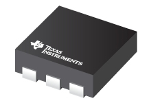

### Texas Instrument: **TMP116**

High-Accuracy, Low-Power, Digital Temperature Sensor With SMBus- and I2C-Compatible Interface.
Medical grade: meets ASTM and ISO spec

| Device  	| Resol.	|  			| Accuracy	| Test Range	| Work Range	| Supply (V)| I (uA)| Interface |
| :-		| :-  		| :-  		| :-    	| :- 			| :-			| :-		| :-	| :-		|
| TMP116	| 16 bit  	| 			| ±0.2°C	| –10°C to +85°C| 				| 1.9 - 5.5	| 200	| I2C		|

Long Term Stability = ±1 LSB @ V+ = 3.3 V, 8 averages, 1-Hz sampling

### Supplier

| Supplier: Code				|  Units: Price 				| 
|-------------------------------|-------------------------------| 
| DIGIKEY: 1568-SEN-15805-ND	| 	€ 12,67						|

## [home](../)

[item-image]: TMP116.jpg
[item-link]: https://www.ti.com/product/TMP116
[item-datasheet]: TMP116.pdf
