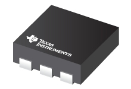
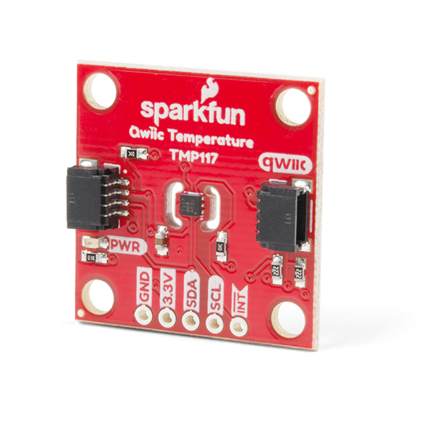

### Texas Instrument : **TMP117**

[item-image]: TMP117.jpg
[item-link]: https://www.ti.com/product/TMP117
[item-datasheet]: TMP117.pdf

The [TMP117][item-link] is a high-precision digital temperature sensor. 
It is designed to meet **ASTM E1112** and **ISO 80601** requirements for electronic patient thermometers. 
The TMP117 provides a 16-bit temperature result with a resolution of 0.0078°C and an accuracy of up to ±0.1°C across the temperature range of -20°C to 50°C with no calibration. 

| Device  	| Resol.	|  			| Accuracy	| Test Range	| Work Range	| Supply (V)| I (uA)| Interface |
| :-		| :-  		| :-  		| :-    	| :- 			| :-			| :-		| :-	| :-		|
| TMP117	| 16 bit  	| 			| ±0.1°C	| 0°C to +85°C  | -55 to 150	| 1.8 - 5.5	| 5		| I2C		|

### Supplier

| Supplier: Code				|  Units: Price 				| 
|-------------------------------|-------------------------------| 
| DIGIKEY: 		 				| 	€ 12,67						|

### Description

The TMP117 has 

- interface that is **I2C** and SMBus™-compatible, 
- programmable alert functionality,
-  the device can support up to four devices on a single bus. 
- Integrated EEPROM is included for device programming with an additional 48-bits memory available for general use.

The low power consumption of the TMP117 minimizes the impact of self-heating on measurement accuracy. The TMP117 operates from 1.8 V to 5.5 V and typically consumes 3.5 µA.

For non-medical applications, the TMP117 can serve as a single chip digital alternative to a Platinum RTD. The TMP117 has an accuracy comparable to a Class AA RTD, while only using a fraction of the power of the power typically needed for a PT100 RTD. The TMP117 simplifies the design effort by removing many of the complexities of RTDs such as precision references, matched traces, complicated algorithms, and calibration.

The TMP117 units are 100% tested on a production setup that is NIST traceable and verified with equipment that is calibrated to ISO/IEC 17025 accredited standards.

### Developement Board - SparkFun Electronics: SEN-15805 

      
**SEN-15805:** Sparkfun developement board

| Supplier: Code				|  Units: Price 				| 
|-------------------------------|-------------------------------| 
| DIGIKEY: 1568-SEN-15805-ND 	| 1pcs:	€ 12,67000				|

## [home](../)
